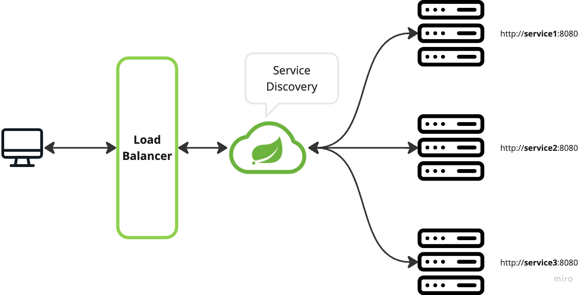

# Service Discovery

# Spring Cloud Netflix Eureka



- 클라이언트는 Gateway를 통해 요청을 전달
- Eureka 서버에 각 서비스 인스턴스를 등록
    - key-value 형태로 요청정보가 어떤 서비스로 가야하는지 저장됨
- Service Discovery를 통해서 각 서비스로 요청 전달

## Service Discovery

### gradle

```jsx
dependencies {
    implementation 'org.springframework.cloud:spring-cloud-starter-netflix-eureka-server'
}
```

### application

```java
@SpringBootApplication
@EnableEurekaServer // Eureka Server 역할을 하기위한 등록
public class EcommerceApplication {

	public static void main(String[] args) {
		SpringApplication.run(EcommerceApplication.class, args);
	}

}
```

### application.yml

```yaml
server:
  port: 8761

spring:
  application:
    name: discoveryservice

eureka:
  client:
    register-with-eureka: false
    fetch-registry: false
```

- spring.application.name : 마이크로 서비스의 고유한 아이디, application name 지정
- eureka client → 유레카 서버로만 기동되면 되기때문에 설정을 꺼줌
    - eureka.client.register-with-eureka : true(default) → 유레카 서버에 등록한다
    - eureka.client.fetch-registry : true(default) → 유레카 서버로부터 정보를 주고받는다
