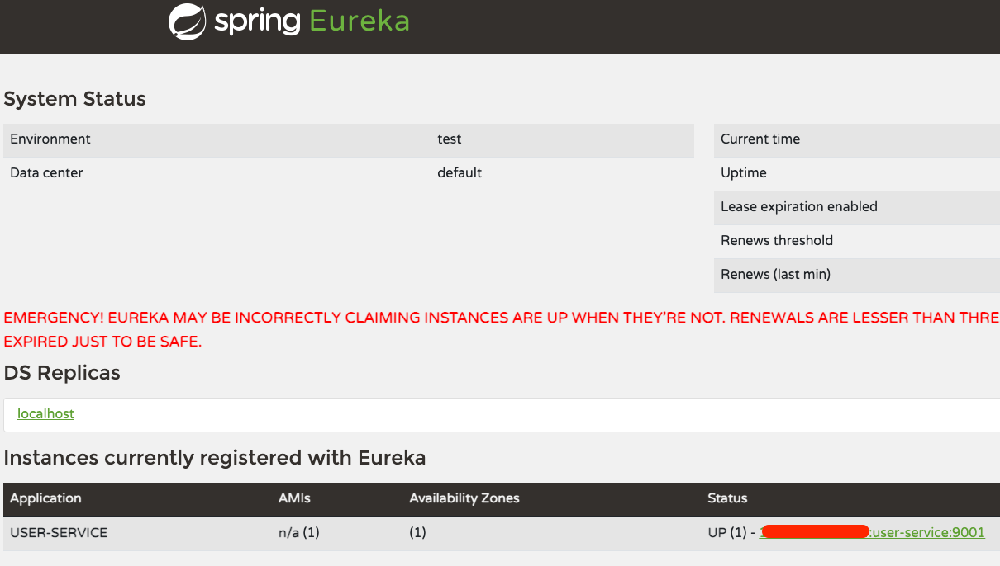
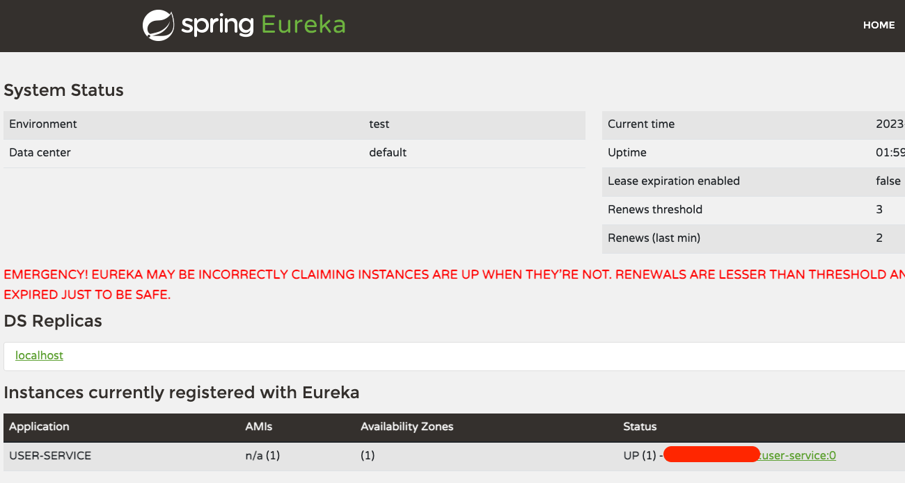
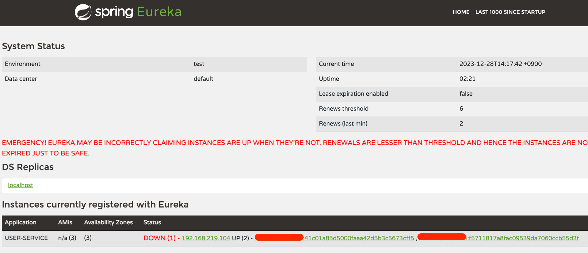

## User Service

### gradle

```groovy
dependencies {
    implementation("org.springframework.boot:spring-boot-starter-web")
    implementation("org.springframework.cloud:spring-cloud-starter-netflix-eureka-client")
    implementation("com.fasterxml.jackson.module:jackson-module-kotlin")
    implementation("org.jetbrains.kotlin:kotlin-reflect")
    developmentOnly("org.springframework.boot:spring-boot-devtools")
    testImplementation("org.springframework.boot:spring-boot-starter-test")
}
```

### application

```kotlin
@SpringBootApplication
@EnableDiscoveryClient // 클라이언트로 등록
class UserServiceApplication

fun main(args: Array<String>) {
    runApplication<UserServiceApplication>(*args)
}
```

### yaml

```yaml
server:
  port: 9001

spring:
  application:
    name: user-service

eureka:
  client:
    register-with-eureka: true
    fetch-registry: true
    service-url:
      defaultZone: http://127.0.0.1:8761/eureka
```

- service name : user-service
- eureka client 설정
    - register-with-eureka : 유레카 서버에 등록함
    - fetch-registry: 유레카 서버로부터 인스턴스 정보를 주기적으로 가져올 것인지 설정
    - service-url : 유레카 클라이언트를 등록할 서버의 위치를 지정 

## User Service Load Balancer

Random Port 사용으로 같은 서비스 2개 실행 → 등록된 service는 하나로 나옴

```yaml
server:
  port: 0   #random port
```

> Yaml 파일을 기준으로 표시함 `{작동중인host-address}:{service-name}:{port}`
`server.port: 0` 하나만 있는것으로 인식하여 하나만 리스트업
>



---

instance-id를 등록하여 두개의 서비스가 리스트업 되도록 해보자

```yaml
server:
  port: 0   #random port

spring:
  application:
    name: user-service

eureka:
  instance:
    instance-id: ${spring.cloud.client.hostname}:${spring.application.instance_id:${random.value}}
  client:
    register-with-eureka: true
    fetch-registry: true
    service-url:
      defaultZone: http://127.0.0.1:8761/eureka
```

- random port로 인스턴스 실행
- eureka.instance.instance-id : 인스턴스 아이디 등록

이제 서비스가 모두 리스트업 된것을 확인


