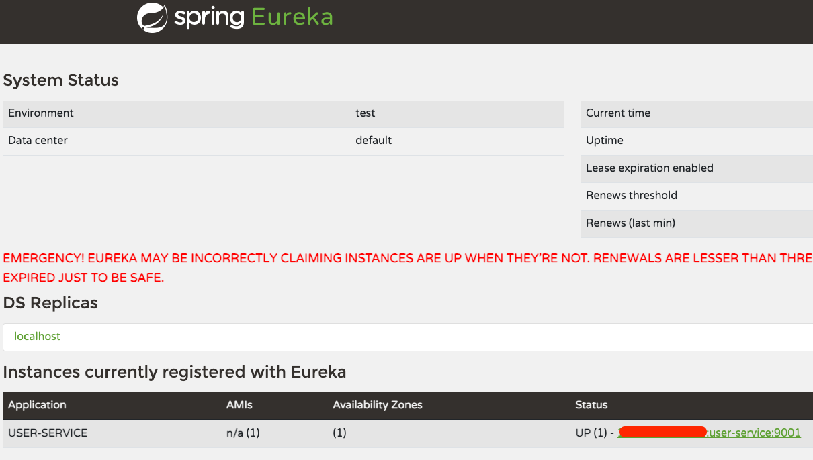

## User Service

### gradle

```groovy
dependencies {
    implementation("org.springframework.boot:spring-boot-starter-web")
    implementation("org.springframework.cloud:spring-cloud-starter-netflix-eureka-client")
    implementation("com.fasterxml.jackson.module:jackson-module-kotlin")
    implementation("org.jetbrains.kotlin:kotlin-reflect")
    developmentOnly("org.springframework.boot:spring-boot-devtools")
    testImplementation("org.springframework.boot:spring-boot-starter-test")
}
```

### application

```kotlin
@SpringBootApplication
@EnableDiscoveryClient // 클라이언트로 등록
class UserServiceApplication

fun main(args: Array<String>) {
    runApplication<UserServiceApplication>(*args)
}
```

### yaml

```yaml
server:
  port: 9001

spring:
  application:
    name: user-service

eureka:
  client:
    register-with-eureka: true
    fetch-registry: true
    service-url:
      defaultZone: http://127.0.0.1:8761/eureka
```

- service name : user-service
- eureka client 설정
    - register-with-eureka : 유레카 서버에 등록함
    - fetch-registry: 유레카 서버로부터 인스턴스 정보를 주기적으로 가져올 것인지 설정
    - service-url : 유레카 클라이언트를 등록할 서버의 위치를 지정 
