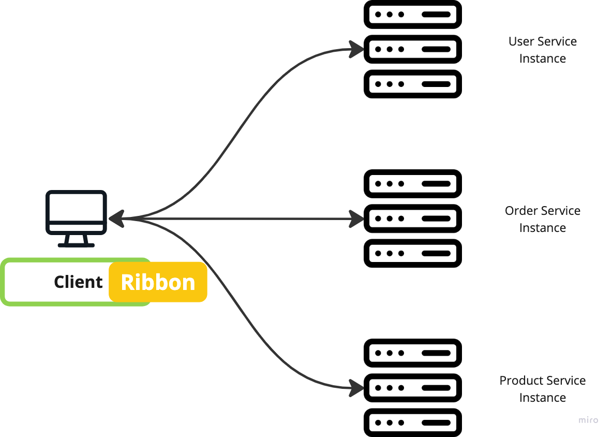
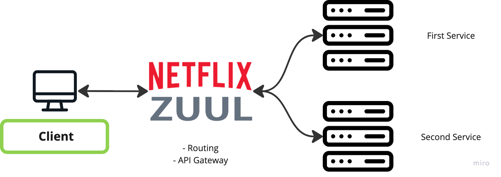

# API Gateway Service

# API Gateway

- 인증 및 권한 부여
- 서비스 검색 통합
- 응답 캐싱
- 정책, 회로 차단기 및 QoS 다시 시도
- 속도 제한
- 부하 분산
- 로깅, 추적, 상관 관계
- 헤더, 쿼리 문자열 및 청구 변환
- IP허용 목록에 추가

## Netflix Ribbon

- Spring Cloud에서 MSA간 통신
    - RestTemplate
    - Feign Client
- Ribbon : **Client Side** Load Balancer
    - 서비스 이름으로 호출
    - Health Check
    - 단점
        - 비동기를 지원하지 않음
        - Spring Boot 2.4에서 Maintanance 상태

      


## Netflix Zuul



### yaml

```yaml
spring:
  application:
    name: my-zuul-service

zuul:
  routes:
    first-service:
      path: /first-service/**
      url: http://localhost:8081
    second-service:
      path: /second-service/**
      url: http://localhost:8082

```

- Zuul Gateway Routing 설정

### Filter

- Zuul Gateway 에 필터를 설정

```java
@Slf4j
@Component
public class ZuulLoggingFilter extends ZuulFilter {
	
	@Override
	public Object run() throws ZuulException{
		log.info("**** printing logs : ");

		RequestContext ctx = RequestContext.getCurrentContext();
		HttpServletRequest request = ctx.getRequest();

		log.info("**** " + request.getRequestURI() + " ****");
		return null;
	}

	@Override
	public String filterType() {
		return "pre";
	}

	@Override
	public int filterOrder(){
		return 1;
	}

	@Override
	public boolean shouldFilter(){
		return true;
	}
}
```

- [localhost:8080](http://localhost:8080/)/first-service/welcome
- [localhost:8080](http://localhost:8080/)/second-service/welcome
